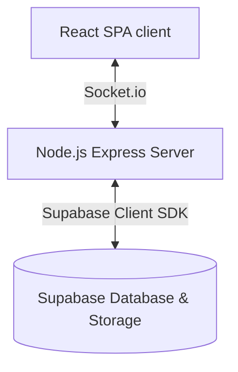

# Technical Summary: Pre-Freshy Activity Web Application

This document provides a technical summary and architectural overview of the Pre-Freshy Activity platform. The application supports two distinct real-time game modules: **Prediction Challenge** and **Python Dutch Auction**.

---

## 1. System Architecture

The platform uses a client-server architecture built on modern web technologies:



* **Frontend**: Single Page Application built using React, Vite, and vanilla CSS.
* **Backend**: Express.js server running in Node.js.
* **Real-Time Layer**: Socket.io for synchronous game-state broadcasting and events.
* **Database & Assets Storage**: Supabase (Cloud SQL DB with JSONB storage and a public Storage Bucket for question media).

---

## 2. Database Schema & Storage

### 2.1 Supabase Database Configuration
The server interacts with a table named `game_state` which stores the runtime data of all rooms in JSONB format.

```sql
CREATE TABLE IF NOT EXISTS game_state (
  id VARCHAR PRIMARY KEY, -- Room ID (e.g. 'prediction', 'auction')
  data JSONB NOT NULL,    -- Complete runtime configuration, questions, players and submissions
  updated_at TIMESTAMP WITH TIME ZONE DEFAULT CURRENT_TIMESTAMP
);
```

### 2.2 Assets Storage
* **Bucket**: `question-media` (configured with public select permissions).
* **Upload Mechanism**: Base64 data chunks submitted by organizers are parsed, converted into binaries, and uploaded directly to Supabase via `@supabase/supabase-js`.

---

## 3. Game Mode Mechanics

### 3.1 Prediction Challenge (PIN: 2026)
A football-themed betting simulator where players predict whether matches will end in "HI" or "LOW" scores relative to a referee line.

* **Silver Goal (SG)**: Activatable only on **MEDIUM** matches. Multiplies correct predictions by 1.5x (+15 tokens instead of 10). Single-use per player.
* **Golden Goal (GG)**: Activatable only on **HARD** matches. Awards a massive bonus (+20 tokens). Single-use per player.
* **PRE-MATCH Trial**: A trial round where correct and participation payouts are locked to **0 tokens**. The countdown timer is disabled so instructors can explain the game rules.
* **Tied Outcome (50/50 PUSH)**: When the prediction vote results in exactly 50% YES and 50% NO, all participating players who submitted a vote receive a flat **8 tokens** (+ 2 participation tokens).
* **Dynamic Reveal Style**: The presenter can choose the reveal mode in real-time:
  * **VAR Reveal**: A 3-second suspensive review overlay.
  * **Penalty Shootout**: An instant 0.5-second reveal.

### 3.2 Python Dutch Auction (PIN: 1127)
A programming team challenge where groups bid on python programming challenges.

* **Initial State**: Teams register and start with 100 tokens.
* **Dutch Auction Price Drop**: Prices start high (Easy: 40, Medium: 60, Hard: 80) and drop by 5 tokens every 1.5 seconds down to a minimum of 10 tokens.
* **Race Condition Lock**: First-in socket request for the `buy-auction` event locks the slot, deducts tokens immediately, and rejects any subsequent clicks.
* **Evaluation & VAR**: The winner writes Python code. The referee evaluates it:
  * **Correct**: Refunded Bid + Difficulty Bonus (Easy: +20, Medium: +35, Hard: +50).
  * **Incorrect**: Purchase bid is lost.
* **Bankruptcy Trigger (Open Questions)**: If any team hits 0 tokens, the game enters a 4-choice Multiple Choice **Open Question** round. All groups answer simultaneously, and results are revealed turn-based from lowest-token groups to highest-token groups to build tension.

### 3.3 Ranks Logic
 Ranks are calculated on the server using **Standard Competition Ranking** (1-2-2-4 rule):
* Players with matching token values share the same ranking position (e.g. three players with 150 tokens share rank 🥇).
* The next rank skips index values (e.g. 1st, 1st, 1st, then 4th).

---

## 4. Socket.io Events Specification

### 4.1 Admin Control Events
| Event Name | Payload | Description |
| :--- | :--- | :--- |
| `admin-open-question` | `{ roomId, questionId }` | Launches a prediction match. |
| `admin-close-submissions` | `{ roomId }` | Closes active submissions. |
| `admin-reveal-results` | `{ roomId, revealStyle }` | Triggers VAR or Penalty results calculations. |
| `admin-cancel-round` | `{ roomId }` | Cancels active round, restores powerups. |
| `admin-reopen-round` | `{ roomId }` | Transitions room state back to active. |
| `admin-unlock-question` | `{ roomId, questionId }` | Unlocks a question to allow replays. |
| `admin-start-auction` | `{ roomId, questionId }` | Launches a Dutch Auction question and begins price drop. |
| `admin-reveal-auction-results` | `{ roomId, isCorrect }` | Evaluates Dutch Auction code answer. |
| `admin-launch-open-question`| `{ roomId, questionId }` | Starts an Open MCQ round. |
| `admin-reveal-open-results` | `{ roomId }` | Reveals MCQ scores turn-by-turn. |

### 4.2 Client Interactions Events
| Event Name | Payload | Description |
| :--- | :--- | :--- |
| `join-game` | `{ pin, nickname }` | Validates duplicate name and joins socket room. |
| `submit-prediction` | `{ roomId, answer, prediction, useGoldenGoal, useSilverGoal }` | Lock in match prediction and token power-ups. |
| `buy-auction` | `{ roomId, price }` | Attempt first-in snatch of Dutch Auction question. |
| `submit-auction-answer` | `{ roomId, codeAnswer }` | Snatched team submits written python code. |
| `submit-open-answer` | `{ roomId, answer }` | Submit A/B/C/D option in Open Question. |

---

## 5. Client View Architecture

* **[App.jsx](file:///c:/Users/Jean/Documents/pre-freshy%20Activity/src/App.jsx)**: Hub entry routing. Manages credentials, PIN validations, and workspace distribution (Prediction vs Auction).
* **[PlayerView.jsx](file:///c:/Users/Jean/Documents/pre-freshy%20Activity/src/views/PlayerView.jsx)**: Dynamic mobile client panel. Swaps layout configurations depending on the room mode (e.g. prediction buttons vs Dutch Auction snatch trigger and MCQ option buttons).
* **[ProjectorView.jsx](file:///c:/Users/Jean/Documents/pre-freshy%20Activity/src/views/ProjectorView.jsx)**: Large screen arena view. Renders the timer, answer count HUD, VAR overlay animations, price tickers, and podium rankings using the server-calculated `currentRank`.
* **[OrganizerView.jsx](file:///c:/Users/Jean/Documents/pre-freshy%20Activity/src/views/OrganizerView.jsx)**: Referee command cockpit. Includes question builders, live layout previews, player bank accounts adjustment panel, and live VAR outcome buttons.

---

## 6. Build and Verification Command

To build the client assets for production:
```powershell
npm run build
```
Output files are saved to `/dist` directory for static rendering.

---

## 7. Player Session Persistence Mechanism (Device vs Browser)

A common point of inquiry is why **changing the player nickname on the same device keeps the same account/tokens**, but **switching to a different browser on the same device creates a new player account**.

### 7.1 Tech Stack Behind Session Persistence
Player identities are persisted on the client side using **Web Local Storage (`localStorage`)**:
1. **Initial Visit**: When a player opens the game, the React client (`App.jsx`) checks for a key named `python_wc_player_id` in `localStorage`. If it doesn't exist, the client generates a unique string identifier (e.g. `p-7x9z1a-3m8p9q`) and saves it.
2. **Re-connection**: Every time the player refreshes the tab or rejoins, this stored `playerId` is read from `localStorage` and sent over the WebSocket to the server via the `join-game` event.
3. **Updating Nickname**: If the user submits a new nickname in the lobby, the server uses their `playerId` to locate their player record in memory. It updates the `name` field but preserves all other accumulated states (`fanTokens`, `goals`, `matchesPlayed`, `history`).

### 7.2 Why Changing Browsers Resets the Account
* **Local Storage Isolation**: Web browsers enforce strict sandbox boundaries. The `localStorage` storage space is partitioned **per origin and per browser application**.
* Chrome, Safari, Firefox, and Edge cannot access each other's storage databases.
* Switching to a different browser (or opening an Incognito/Private window) forces the client script to run with an empty `localStorage` state. Consequently, a new `playerId` is generated, which the server treats as a brand-new player registration.

